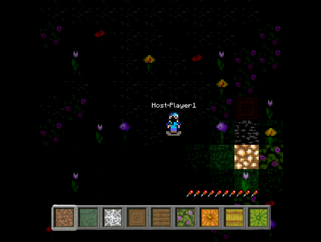

# Project-quadtree



Ce projet fut l'un des projets de première année, il est codé en Goland et il s'agît d'une adaptation d'un code basique d'un jeu cubique.

J'ai fait le choix de transformer le Jeu pour pouvoir acceuillir du Multijoueur, pour que les textures soient plus jolies que celles qui étaient données par défaut ainsi que de pouvoir se balader à l'infini avec génération de chunks. J'ai en plus ajouter des particules, un cycle jour/nuit et des musiques choissies de façon intelligentes (de façon à ce que ce soit pas toujours les mêmes) ainsi que des bruits d'ambiances.

Le multijoueur ne fonctionne pas toujours super bien (concernant les mouvements), le version finale a été supprimée, le jeu actuel est la dernière version que j'ai pu retrouver !

## Comment lancer le jeu
Deux choix s'offrent à vous pour tester le projet, le premier : ouvrir ce fichier .EXE [ici](./cmd/main.exe) mais ne permet que de jouer en tant qu'hôte de partie sur windows ou sinon, vous pouvez lancer le jeu avec Goland en suivant les instructions suivante :

- Installer Goland si ce n'est pas déjà fait depuis ce lien : [Installer Goland ici](https://go.dev/doc/install)
- Ouvrir un terminal
- Se placer dans le bon répertoire (se placer dans ce dossier puis le dossier cmd) avec la commande à écrire
```
cd <répertoire>/cmd
```

Ensuite faire le choix de host ou client (local)
- Pour lancer le jeu en tant qu'hôte principal
```
go run main.go -config config-host.json
```

- Pour lancer le jeu en tant que client (ou hôte secondaire)
```
go run main.go -config config-client.json
```

Pour modifier son nom ou ip et port en étant hôte principal [cliquez ici](./cmd/config.json) et en tant que client / hôte secondaire [cliquez ici](./cmd/config-client.json).

Il faut rechercher ServerAddr et PlayerName en bas du fichier !

La map générée avec une seed est stockée dans floor-dir. Pour recommencer une nouvelle map, vous pouvez supprimer tous les chunks (la map n'est pas générée entièrement dès le chargement du jeu!).